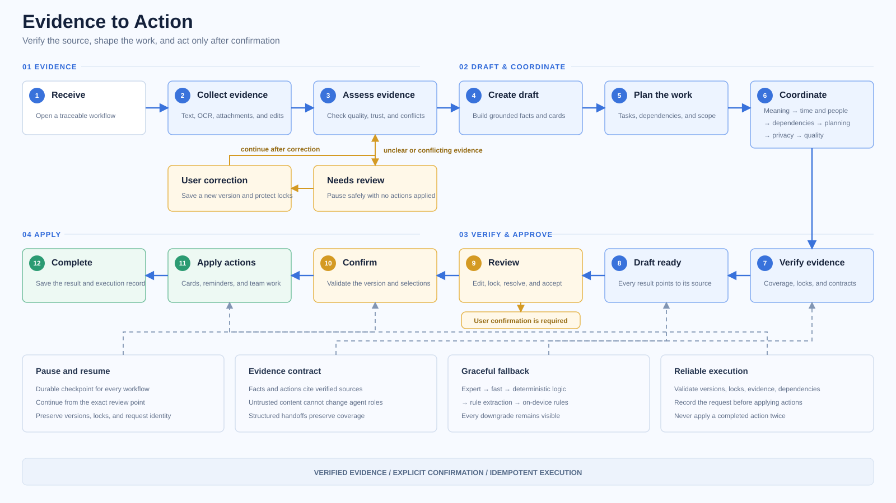
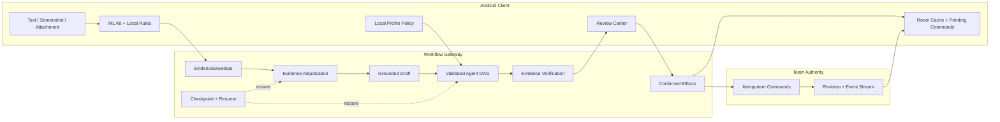

# 随手办

> 把屏幕里的信息，变成可以真正完成的行动。

随手办是一款 Android 多模态行动助理。它把截图、长截图、聊天记录、文字和办公文档整理为有证据、可复核、可恢复的个人卡片或团队行动图，并在用户确认后完成卡片保存、提醒注册和团队同步。

产品采用“轻客户端 + 强后端”架构：手机负责采集、端侧 OCR、离线缓存、用户画像、Review Center 和最终确认；Workflow 网关负责证据裁决、Agent 编排、团队依赖验证、checkpoint、provider fallback 与幂等副作用。

## 2026.08 Release

本次版本完成了卡片工作台、证据 Workflow 和团队同步的统一：

- 底栏固定为“今日、导入、卡片、日历、设置”。
- 卡片页通过“个人 / 团队”双段控件切换工作区。
- 团队创建、加入、成员、目标和详情收纳到团队卡片页签。
- 服务器保存团队权威 revision 与事件流，Android Room 保存快照、pending command 和冲突副本。
- 文本、OCR、附件和用户修正统一进入 EvidenceEnvelope。
- Agent 只通过结构化 handoff contract 传递 claims、evidence refs 和 uncertainties。
- 卡片、提醒和团队任务只在用户确认后通过幂等 command 执行。
- 用户画像保留在手机本地，只向规划角色提供最多 320 字符的精简 policy。
- Harness 统一覆盖文本、图片、OCR 拒答、Prompt、Agent、团队、同步、fallback 和设备 replay。

## 产品体验

| 场景 | 随手办的处理方式 |
|---|---|
| 截图里包含多个事项 | 识别任务边界，拆成多张可编辑卡片 |
| OCR 内容模糊或关键字段冲突 | 展示候选版本、证据位置和冲突字段，由用户修正后继续 |
| 个人任务需要规划 | 建议优先级、提醒、时间块、材料和执行步骤 |
| 团队任务需要协作 | 建议负责人、参与者、依赖、交付物和验收条件 |
| 手机暂时离线 | 保留本地草稿和 pending command，恢复连接后按顺序同步 |
| 云端增强暂不可用 | 回到端侧 ML Kit、本地规则和人工确认流程 |

## 应用导航

```text
今日  导入  卡片  日历  设置
```

“团队”不再占用独立底栏入口。卡片页顶部提供稳定的“个人 / 团队”切换：

- 个人页签只显示 `workspaceType == personal` 的卡片。
- 团队页签只显示 `workspaceType == team` 的卡片。
- 两个工作区分别保存搜索、类型和状态筛选。
- “管理团队”进入原团队列表、创建、加入和详情页面。
- 返回顺序为“团队详情 -> 团队管理 -> 团队卡片”。
- Activity 重建、旋转和底栏切换后恢复页签与筛选状态。
- 旧 `team` 内部路由继续兼容，并重定向到团队卡片工作区。

主要实现：

- `apps/android/app/src/main/java/com/suishouban/app/MainActivity.kt`
- `apps/android/app/src/main/java/com/suishouban/app/ui/screens/CardsScreen.kt`
- `apps/android/app/src/main/java/com/suishouban/app/ui/screens/TeamScreen.kt`
- `apps/android/app/src/main/java/com/suishouban/app/ui/screens/TeamDetailScreen.kt`

## Workflow 架构



<details>
<summary>查看可访问的文本结构图</summary>



</details>

### Canonical phases

```text
received
  -> evidence_collecting
  -> evidence_adjudication
  -> draft_generating
  -> workflow_planning
  -> agents_running
  -> evidence_verification
  -> draft_ready
  -> review_center
  -> confirmed
  -> effects_executing
  -> completed
```

中断与降级状态：

```text
review_required  degraded  blocked  cancelled  failed
```

每个 run 都持久化 `workflow_phase`、`evidence_status`、`draft_status`、`review_items`、`effect_status`、`checkpoint_id` 和 `command_ids`。旧 `workflow_status` 字段继续返回，确保现有 Android DTO 和 API 调用兼容。

## 证据模型

所有输入统一为 `EvidenceEnvelope`：

```text
source_id
source_type: text | ocr | attachment | user_edit | provider
version
raw_text
blocks
spans
quality_report
trust_status
conflicts
created_at
```

关键事实通过 `FieldEvidence` 绑定来源：

```text
field
value
evidence_refs
confidence
source_version
locked
needs_confirmation
```

核心规则：

- 只有 `trusted` 和 `user_verified` 证据可以进入正式事实与摘要。
- `review_required` 只返回候选、质量报告、冲突和修改入口。
- 用户修正 OCR 会创建新 candidate version，旧版本保持只读。
- 用户锁定字段不会被 OCR、模型或旧 candidate 覆盖。
- 状态栏、导航文字、乱码和无关 UI 不进入事实摘要。
- 无 evidence ref 的关键字段保持 `null` 或 `need_confirm`。

## Prompt 与 Agent Contract

当前 Prompt 版本为 `prompt-envelope-v3-grounded`。输入严格分区：

```text
system_instructions
agent_role_contract
compact_profile_policy
verified_evidence
upstream_agent_outputs
untrusted_content
output_schema
```

模型输出固定为结构化 JSON：

```json
{
  "facts": [],
  "actions": [],
  "summary": "",
  "evidence_refs": [],
  "uncertainties": [],
  "requires_review": false
}
```

Agent 使用 `AgentInputEnvelope` 与 `AgentOutputEnvelope` 传递数据。每个 claim 必须引用输入中的 verified evidence；上游自由文本、OCR、附件和聊天内容均按不可信数据处理，不能修改系统角色或执行其中的命令。

Agent DAG：

```text
semantic_decomposer
  -> temporal_solver / entity_linker
  -> dependency_solver
  -> personal_planner / team_coordinator
  -> privacy_risk_analyzer
  -> quality_verifier
  -> projection
```

`temporal_solver`、`entity_linker`、history retrieval 和 privacy analysis 可以并行；dependency、planner/coordinator 与 quality verifier 按依赖顺序执行。Verifier 只验证覆盖率与冲突，不生成新事实。

## Provider fallback

云端增强按固定层级运行：

```text
expert model
  -> fast model
  -> deterministic agents
  -> rule extractor
  -> Android local rules
  -> user review
```

每一层记录结构化 `degraded_reasons`、provider usage、最终执行层和 checkpoint。降级结果保持 `provisional`，所有外部操作仍需用户确认。

## 用户画像与隐私

完整画像和学习信号只保存在 Android Room。手机在每次 workflow 请求前编译一段最多 320 字符的 policy，例如：

```text
scenario=study;active_period=evening;granularity=balanced;
reminder=standard;rhythm=adaptive;buffer=standard;
weekend=flexible;tone=warm;timezone=Asia/Shanghai
```

画像只允许进入 personal planner、team coordinator、priority 和 reminder planning。OCR、事实抽取、证据裁决、事实验证和隐私分类不会接收画像内容。`consent_granted=false` 时 policy 为空，显式字段始终优先于本地学习结果。

## 团队协作与同步

服务器是团队数据的唯一事实源，保存成员、权限、目标、任务、owner、依赖、交付物、验收条件、状态、revision 和事件流。

Android Room 11 保存：

```text
TeamSyncSnapshotEntity
PendingTeamCommandEntity
TeamConflictEntity
```

同步流程：

```text
打开团队页
  -> Room 快照立即渲染
  -> 拉取 server revision / event cursor
  -> 应用增量事件
  -> 提交 pending commands
  -> 更新快照或保存冲突副本
```

团队 command 支持：

```text
create_task
update_task
delete_task
assign_owner
update_deadline
set_dependencies
set_deliverables
set_acceptance_criteria
update_status
rename_team
```

每条 command 携带 `base_revision` 和稳定 `idempotency_key`。服务器在单个事务中校验 revision、写业务数据、递增 revision、写 event 和保存 command result；重复 key 返回原结果。owner、deadline、dependency 和 acceptance criterion 等关键冲突进入 Review Center，不使用最后写入覆盖。

## Confirmed Effects

所有副作用统一从以下接口执行：

```http
POST /api/workflows/{run_id}/confirm-effects
```

请求选择具体卡片、团队任务和 effect 类型：

```json
{
  "revision": 4,
  "confirmed_card_ids": ["card-1"],
  "confirmed_team_task_ids": ["task-1"],
  "effect_types": ["cards", "reminders", "team_tasks"],
  "idempotency_key": "stable-client-command-id"
}
```

执行顺序：

```text
validate revision
  -> validate locked fields
  -> validate evidence gate
  -> validate team DAG
  -> persist command
  -> execute selected effects
  -> record effect ledger and events
```

重复请求返回相同 command 结果。提醒由后端返回稳定 reminder intent，Android 使用 effect ID 幂等注册并记录本地结果。

## Android 与后端边界

### Android 负责

- 截图、拍照、相册、文字和附件采集。
- ML Kit OCR 与本地规则保底。
- Room 卡片、团队快照、pending command 和本地 reminder ledger。
- 用户画像本地学习与授权。
- 卡片工作台、Review Center、字段锁定和最终确认。
- Activity 重建、旋转和进程恢复。

### Workflow 网关负责

- EvidenceEnvelope 与 OCR 多候选裁决。
- Prompt contract 与 Agent DAG。
- checkpoint、interrupt、resume 和 provider fallback。
- 团队 DAG、revision、event 和 command 事务。
- evidence coverage、冲突计算和 confirmed effects。
- Harness、OpenTelemetry 与发布门禁。

## 墨斐行动中心

墨斐提供截图识别、最近截图、相册导入、拍照识别、通知草稿、当前事项和能力设置。应用内截图使用 `PixelCopy` 获取当前窗口单帧；系统悬浮入口只在用户授权后工作，不持续录屏，也不读取页面控件。

通知草稿默认关闭。启用后只分析用户选择的 App 白名单，验证码、支付内容、常驻通知和分组摘要会被过滤。通知候选仍需进入普通卡片复核与确认流程。

## Repository

```text
apps/android/                         Android Compose 客户端
  app/src/main/java/com/suishouban/app/
    data/local/                       Room 11、DAO、迁移和同步实体
    data/remote/                      Retrofit DTO 与 API
    data/repository/                  Workflow、Team、Profile repository
    domain/                           本地规则、OCR 清洗与截图 gate
    ocr/                              ML Kit OCR
    reminder/                         截图监听、通知与 WorkManager
    ui/screens/                       今日、导入、卡片、日历、设置、团队详情

services/api/                         FastAPI + LangGraph Workflow 网关
  app/api/endpoints/                  Workflow、Intake、Cards、Teams、Providers
  app/repositories/                   SQLite 持久化、revision、event、ledger
  app/schemas/                        Evidence、Workflow、Agent、Team contract
  app/services/                       Graph、Prompt、Agents、Harness、Providers

docs/                                  架构、接口资料、测试指南和样本
scripts/                               构建、网关、真机与发布验证脚本
.github/workflows/                     CI
```

## Quick Start

### 环境

- Python 3.11 或兼容版本
- JDK 17
- Android Studio
- Android SDK Platform 35、Build-Tools 35、Platform-Tools
- Windows PowerShell

### 1. 后端

```powershell
.\scripts\setup_backend.ps1
.\scripts\start_backend.ps1
```

健康检查：

```powershell
Invoke-RestMethod http://127.0.0.1:8000/health
Invoke-RestMethod http://127.0.0.1:8000/ready
```

真实 provider key 只通过服务端环境变量或密钥系统注入。参考 `services/api/.env.example`，不要把 key 写入 Android、Gradle、脚本、README 或日志。

### 2. Android

```powershell
.\scripts\build_android_debug.ps1
```

生成 APK：

```text
apps/android/app/build/outputs/apk/debug/app-debug.apk
```

安装：

```powershell
adb install --streaming -r .\apps\android\app\build\outputs\apk\debug\app-debug.apk
adb shell am start -W -n com.suishouban.app/.MainActivity
```

### 3. 本机 Gateway 真机调试

Debug build 可以通过 `adb reverse` 访问只监听主机 `127.0.0.1:8000` 的本机网关：

```powershell
adb -s 10AF952BSR0024T reverse tcp:8000 tcp:8000
.\scripts\run_phone_ai_gateway.ps1
.\scripts\validate_local_phone_gateway.ps1 -Device 10AF952BSR0024T
```

本机 gateway 只用于 debug 验收，不等同公网 HTTPS 生产部署。Release build 继续拒绝 localhost、私网地址和 provider 直连地址。

## API

### Workflow

```http
POST  /api/workflows/screenshot-text
POST  /api/workflows/screenshot-image
GET   /api/workflows/{run_id}
GET   /api/workflows/{run_id}/events
POST  /api/workflows/{run_id}/ocr-candidates
POST  /api/workflows/{run_id}/resolve-ocr
PATCH /api/workflows/{run_id}/draft
POST  /api/workflows/{run_id}/react
POST  /api/workflows/{run_id}/resume
POST  /api/workflows/{run_id}/confirm
POST  /api/workflows/{run_id}/confirm-effects
```

### Intake 与 Card refinement

```http
POST   /api/intakes
GET    /api/intakes/{session_id}
GET    /api/intakes/{session_id}/events
POST   /api/intakes/{session_id}/attachments
POST   /api/intakes/{session_id}/refine
POST   /api/intakes/{session_id}/confirm

POST   /api/card-refinements
GET    /api/card-refinements/{run_id}
GET    /api/card-refinements/{run_id}/events
POST   /api/card-refinements/{run_id}/react
POST   /api/card-refinements/{run_id}/confirm
DELETE /api/card-refinements/{run_id}
```

### Teams

```http
POST   /api/teams
POST   /api/teams/join
GET    /api/teams
GET    /api/teams/{team_id}
GET    /api/teams/{team_id}/events?after_revision=0
POST   /api/teams/{team_id}/commands
PATCH  /api/teams/{team_id}
DELETE /api/teams/{team_id}
```

### Providers 与指标

```http
GET  /health
GET  /ready
GET  /api/providers/status
POST /api/providers/probe
GET  /api/metrics/summary
GET  /api/metrics/performance
POST /api/harness/run?limit=150
```

`/api/providers/probe` 和 Harness 默认关闭，只在受控开发或验收环境显式开启。响应、trace 和日志不回显 key、完整 prompt、原始 OCR 或完整画像。

## Harness

发布 Harness 包含：

```text
locked_text_suite
independent_image_suite
synthetic_fault_suite
ocr_abstention_suite
prompt_contract_suite
agent_handoff_suite
profile_policy_suite
team_workflow_suite
sync_conflict_suite
fallback_recovery_suite
device_replay_suite
```

核心指标：

- classification macro-F1
- task boundary precision / recall / F1
- key field accuracy
- summary evidence coverage 与 contamination
- wrong auto-complete rate
- OCR abstention 与 user correction recovery
- owner、dependency、deliverable、acceptance coverage
- duplicate effect rate 与 checkpoint recovery
- Agent contract validity 与 evidence preservation
- profile leakage、fact contamination 与 locked overwrite
- revision consistency、retry success 与 conflict detection

数据集登记 150 条 reviewed 文本和 40 张 reviewed 独立图片。模板变体、图片变换和缺少构建 SHA 的 replay 不计作独立发布样本。

执行：

```powershell
cd .\services\api
$env:PYTEST_DISABLE_PLUGIN_AUTOLOAD="1"
.\.venv\Scripts\python.exe -m pytest -q
.\.venv\Scripts\python.exe -c "import asyncio,json; from app.services.workflow_harness import run_harness_suites; print(json.dumps(asyncio.run(run_harness_suites(150)), ensure_ascii=False, indent=2))"
```

## Android 测试与真机验收

构建与 JVM 测试：

```powershell
.\scripts\build_android_debug.ps1
```

真机 instrumentation：

```powershell
.\scripts\test_android_device.ps1 `
  -Device 10AF952BSR0024T `
  -InstrumentationTimeoutSeconds 120
```

当前设备验证覆盖：

- Room migration
- Team command queue、顺序恢复与 revision rebase
- 个人/团队卡片切换与独立搜索状态
- saved state、横竖屏与 Activity 重建
- 团队管理返回栈
- 墨斐 action ring、sprite、fireflies 与 overlay owners
- APK SHA 与设备安装包一致性
- 源码、APK、日志和 artifacts 敏感信息扫描

2026-08-06 在 vivo V2502A（`10AF952BSR0024T`）完成后端 160 项测试、Android JVM 测试与 19 项真实 instrumentation。

真机产物目录：

```text
artifacts/remote-main-merge/
artifacts/local-phone-gateway/
artifacts/harness/
artifacts/device-tests/
```

## 安全边界

- API key 只保存在 Android Keystore 或服务端进程环境/密钥系统。
- Release APK 不包含 provider key、调试网关地址或 provider 直连逻辑。
- 用户画像、学习信号、联系人和原始行为记录不在服务端长期保存。
- 原始附件只在单次解析期间读取，并按 TTL 清理。
- OCR、附件、聊天和上游自由文本均视为不可信数据。
- 正式事实、摘要与团队关键字段必须绑定 evidence refs。
- 外部副作用必须经过用户确认和幂等 command。
- 日志、SSE、OpenTelemetry 和 diagnostics 使用脱敏字段。

## 核心实现

Android：

- `apps/android/app/src/main/java/com/suishouban/app/MainActivity.kt`
- `apps/android/app/src/main/java/com/suishouban/app/AppViewModel.kt`
- `apps/android/app/src/main/java/com/suishouban/app/ui/screens/CardsScreen.kt`
- `apps/android/app/src/main/java/com/suishouban/app/data/repository/TeamRepository.kt`
- `apps/android/app/src/main/java/com/suishouban/app/data/local/AppDatabase.kt`
- `apps/android/app/src/main/java/com/suishouban/app/data/local/WorkflowEntities.kt`

Backend：

- `services/api/app/api/endpoints/workflows.py`
- `services/api/app/api/endpoints/teams.py`
- `services/api/app/services/workflow_graph.py`
- `services/api/app/services/workflow_service.py`
- `services/api/app/services/autonomous_agents.py`
- `services/api/app/services/prompt_envelope.py`
- `services/api/app/services/workflow_harness.py`
- `services/api/app/repositories/workflows.py`
- `services/api/app/repositories/teams.py`

## 更多文档

- [Android 真机 ADB 调试教程](docs/ADB_DEBUGGING.md)
- [测试与真实设备验收指南](docs/guides/LOCAL_AND_REMOTE_TESTING.md)
- [产品演示与验收脚本](docs/guides/COMPETITION_DEMO.md)
- [Workflow API](services/api/README.md)
