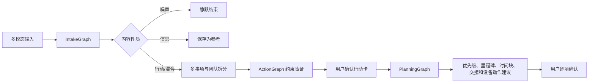

# 随手办

随手办是一款面向真实手机用户的多模态行动助理。它把截图、长截图、聊天记录、文字和常见办公文档整理为可确认的个人或团队行动图，并在卡片创建后持续提供优先级、里程碑、时间块、材料清单和日历建议。

产品默认可以在手机侧独立运行。云端 AI 是可选增强：推荐通过 HTTPS Workflow 网关接入完整 Agent 图；高级用户也可选择手机 BYOK 直连候选增强。API key 只进入 Android Keystore 或服务端密钥环境，不写入 APK、Room、README、日志或诊断导出。

## 当前完成状态

| 能力 | 状态 | 边界 |
|---|---|---|
| 端侧截图 OCR、质量复核、多候选确认、Room 与提醒 | 已闭环 | 低质量 OCR 会停在人工复核；启动时会幂等补注册已确认卡的提醒 |
| HTTPS Workflow、Agent 合约、证据裁决与 ReAct | 可用 | 需要独立部署的公网 HTTPS 网关 |
| 手机 BYOK | 高级实验能力 | 只做 OCR/候选增强，不等同完整 Agent 图 |
| 多文件 Intake 与卡片深度规划 | 部分可用 | 已创建卡可细化；创建前附件 refinement 和 Office 深度解析尚未形成完整 Android 闭环 |
| 本地团队规划 | 实验性 | 有本地字段和约束；尚无账号、邀请、同步和完整成员协作闭环 |
| 工业级锁定评测集 | 建设中 | 当前 20 条人工文本、8 张独立原图；150/40 发布规模门禁尚未满足 |

README 只描述可由当前代码和测试复现的能力。数据集规模、手机网络或 provider 配额未满足时，不应把 smoke 测试、主机探针或接口骨架写成生产验收通过。

## 目录

- [代码结构](#代码结构)
- [完整使用流程](#完整使用流程)
- [后端 Workflow 网关](#后端-workflow-网关)
- [Android 构建与运行](#android-构建与运行)
- [APK 调试流程](#apk-调试流程)
- [真实 Android 设备验收](#真实-android-设备验收)
- [核心代码位置](#核心代码位置)
- [常见问题](#常见问题)

## 用户路径

```text
系统截图 / 墨斐当前屏幕 / 长截图 / 多图 / 聊天 / 文档 / 粘贴文字
  -> 端侧 ML Kit OCR 与噪声清洗
  -> 行动证据判定
  -> 无明确行动：静默忽略
  -> 有明确行动：前台顶部小窗或墨斐悬浮微窗直接提示
  -> 两类小窗均不可用时，使用紧凑“可能有待办”通知兜底
  -> 用户在小窗中选择候选，再决定是否生成草稿或补充材料深度规划
  -> 本地规则先出草稿，云端 Workflow 可异步增强
  -> 用户选择、编辑、确认
  -> 保存 Room 行动卡并注册 WorkManager 截止提醒
  -> 用户可从卡片详情逐项确认系统日历事件
```

确认前不会写入最终卡片、不会注册提醒、不会写日历。确认后手机先以一个 Room 批量事务保存选中卡并幂等注册提醒；云端确认失败只显示同步警告，不会把本地卡片留在无提醒的半完成状态。云端增强只补字段、追加建议或更新证据，不覆盖用户锁定字段。

## 产品原则

- **端侧优先**：OCR、截图 gate、本地规则、多任务拆卡、Room 卡片和提醒均可在手机侧完成。
- **少打扰**：通知采用静默紧凑样式；同一截图被忽略后短时间内不重复提示。
- **证据驱动**：候选卡展示标题、时间、地点/平台、材料/提交方式、证据摘要和置信度。
- **用户确认优先**：候选阶段没有 Room、WorkManager 或日历副作用；系统日历始终通过 `ACTION_INSERT` 交给用户最终确认。
- **云端可插拔**：默认本机模式；推荐由 HTTPS Workflow 网关代理完整 Agent 图；高级 BYOK 只提供 OCR/模型候选增强，不能冒充完整工作流。
- **可降级**：无网、模型失败、OCR 失败时保留本地规则和手动补全入口。

## 个性化与卡片深度计划

首次启动时，墨斐会创建一个中性的本地画像，并邀请用户完成可跳过的逐题问卷。四道核心问题覆盖使用场景、常用时段、规划粒度和提醒风格；配置 HTTPS Workflow 网关后，AI 最多追加三道结构化选择题，用于确认工作节奏、DDL 缓冲、周末安排或助手语气。问卷不采集自由文本，也不推断年龄、性别、职业或其他敏感身份。持续学习默认关闭，必须由用户单独同意；显式问卷和手动设置永远优先于推断结果。

已创建的行动卡可以在卡片中心点开详情，再按需选择“细化此卡片”：

1. 调整本卡的规划粒度、个性化、时间块和里程碑提醒开关。
2. 可补充 PDF、DOCX、PPTX、XLSX、TXT、Markdown、JPG 或 PNG，最多 8 个文件，单个不超过 15 MB，总计不超过 40 MB。
3. 先预览、编辑和选择里程碑、工作时间块、步骤，也可继续用自然语言调整。
4. 只有点击“应用计划”后，计划、附件元数据和里程碑提醒才会写入本地数据库。

本地模式可直接解析 TXT/Markdown、图片 OCR 和受限 PDF OCR；Office 深度解析需要配置公网 HTTPS Workflow 网关。没有明确截止时间时只生成相对顺序和预计耗时，不创建绝对时间提醒。用户画像只影响规划粒度、时间安排和提醒建议，不会改写父卡的标题、DDL、地点等事实字段。

画像和规划设置可在设置页查看、编辑、暂停学习、清除推断、重新问卷或彻底重置。原附件始终由用户设备保管，后端只在单次解析期间临时读取，完成后删除临时副本。

## 统一工作流



### IntakeGraph

- 统一接收文本、图片、长截图、聊天记录、TXT/Markdown、PDF 和 OOXML 文档。
- 图片与扫描 PDF 可调用 vivo OCR；多候选按完整度、布局、关键字段覆盖、乱码、重复块和界面噪声生成质量报告，再做块级对齐与裁决。质量低于 `0.72`、关键时间冲突或任务边界无法确认时会停在 OCR 复核，不会继续生成正式候选卡。
- 内容分类为 `noise | informational | actionable | mixed | uncertain`；`uncertain` 只提供复核入口，避免把普通信息或残缺 OCR 强制变成待办。
- 语义、时间、参与者和质量分析使用 LangGraph `Send` 并行执行；多事项不会按数组下标硬匹配。
- 外部墨斐截图、通知入口和预览共享 `IntakeSession`，Activity 重建后仍能追踪来源。网关会话为恢复和裁决临时保存 OCR/附件提取文本，默认最长 24 小时，并在确认后立即清除正文，只保留脱敏元数据与证据摘要。

### PlanningGraph

- 卡片字段变化时重新计算自适应优先级，并生成里程碑、执行步骤、时间块和设备动作建议。
- 优先级支持 `manual` 与 `adaptive`。手动模式拥有最高优先权，AI 不会改写。
- 卡片列表、候选预览和详情中的优先级标记会打开明确的低/普通/高选择器；手动选择后立即锁定，并同步改变卡片强调边、背景和标签。恢复自动模式后，编辑截止时间、负责人、依赖或状态会先本地重算，再防抖调用 `/api/cards/{id}/replan`。
- 日期和时间统一使用五行居中吸附滚轮，分钟固定为 `00–59` 的 1 分钟精度。事件分别选择开始与结束时间，里程碑和时间块复用同一组件；没有可靠时间时保持“待确认”，不会暗中写入“明天整点”。提醒同时支持“指定时刻”和“截止前偏移”，可新增、编辑、启停、删除和去重。
- 个人与本地团队工作区分离。团队卡支持负责人、参与者、交付物、依赖和交接关系；当前是单设备团队规划能力，不代表成员已经收到任务，首版不包含账号、邀请或跨设备同步。
- 计划验证依赖环、时间倒置、DDL 越界、工作量、缓冲、提醒过载和事实保护。失败计划不能静默应用。

### Prompt 与画像边界

每次请求都会重新编译版本化 `PromptEnvelope`，只包含枚举化的场景、活跃时段、粒度、节奏、缓冲、周末策略、提醒风格、语气和时区，长度上限为 1200 字符。不会累计历史对话，也不会上传原始行为记录。输入文档始终被标记为不可信证据，不能覆盖系统角色；画像只影响规划表达和时间策略，不得修改标题、DDL、地点等事实。

## 墨斐行动中心

应用内轻点墨斐会展开七项冰蓝能力环：截图识别、最近截图、相册导入、拍照识别、通知草稿、当前事项和能力设置。系统悬浮墨斐提供截屏、拍照和相册等紧凑入口。

- 应用内“截图识别”用 `PixelCopy` 截取当前 App 窗口的一帧静态图片，不录屏、不共享屏幕。
- 跨 App 截屏首次使用时需要在系统设置中开启“墨斐一键截屏”。此后点击悬浮墨斐的“截屏”会直接截取一帧并进入 OCR 预览，不再二次确认；服务不读取页面控件、输入内容或持续画面。
- 受系统保护的页面不会返回伪造截图；失败、取消和超时都会恢复悬浮墨斐。
- “最近截图”只匹配系统截图名称或目录，不会退化为读取最近一张普通照片。
- 通知草稿默认关闭。开启通知读取并选择 App 白名单后，墨斐只保存本地候选并仅用端侧规则分析；验证码、支付内容、常驻通知和分组摘要会被过滤。
- 通知候选以“消息萤火”显示。打开后仍进入普通候选预览，只有用户选择并确认才会创建行动卡。
- 图片分享入口已经移除；应用不再声明 ACTION_SEND image/*。
- 截屏缓存位于 App 私有缓存目录，预览关闭后删除；通知候选 24 小时过期。

## 代码结构

```text
apps/android/                         Android Compose 客户端
  app/src/main/java/com/suishouban/app/
    data/                              Room、Repository、远程 DTO/API
    domain/                            本地规则抽取、OCR 清洗、截图 gate
    ocr/                               ML Kit OCR
    reminder/                          截图监听、通知、WorkManager 提醒
    ui/                                Compose 页面与组件

services/api/                          FastAPI + LangGraph Workflow 网关
docs/                                  架构、接口资料、测试指南和报告
scripts/                               构建、部署、真实设备验收脚本
.github/workflows/                     CI
```

## 完整使用流程

### 1. 准备环境

Windows PowerShell 环境下建议准备：

- Python 3.11 或兼容版本。
- Android Studio。
- Android SDK Platform 35、Build-Tools 35、Platform-Tools。
- JDK 17 或 Android Studio 自带 JDK。
- 可选：一台开启 USB 调试的 Android 真机。

确认当前仓库在项目根目录：

```powershell
cd AigcProject
git status --short --branch
```

确认 Android SDK 可用。若 SDK 不在默认位置，构建脚本可以显式传入 `-SdkPath`：

```powershell
.\scripts\build_android_debug.ps1 -SdkPath "<Android SDK 路径>"
```

### 2. 本地端侧闭环运行

只验证 Android 端侧能力时，不需要后端、不需要模型 key。

默认设置：

```text
服务地址 = 空
AI 增强 = 关闭
```

此时 App 不访问 `127.0.0.1`、`10.0.2.2`、局域网 IP 或任何 provider endpoint。截图识别、行动判断、候选卡、保存和提醒均走手机端闭环。

### 3. 启用云端 AI 增强

需要先启动或部署后端 Workflow 网关，再在 App 设置页填写手机可访问的 HTTPS 地址：

```text
https://your-workflow-gateway.example.com/
```

本地开发机上的 `http://127.0.0.1:8000/` 只代表电脑本机。物理 Android 真机访问 `127.0.0.1` 时指向手机自身，不会自动访问电脑。

### 4. 高级 BYOK

设置页的“高级 AI 连接”默认折叠。选择“直接 API（BYOK）”后，可分别配置模型 URL、OCR URL、模型名、AppId/businessid 和 AppKey。该模式只把严格 Schema 的候选交给本地 OCR 质量门控与约束裁决，不运行服务端 LangGraph Agent DAG。

- Chat URL 必须为公网 HTTPS，并拒绝本机、私网、`.local`、userinfo 和重定向。
- 其他 OCR 服务必须使用 HTTPS。
- vivo 官方 OCR 的 HTTP 地址是唯一例外，仅允许精确主机 `api-ai.vivo.com.cn` 与路径 `/ocr/general_recognition`；默认关闭且启用前会明确提示图片与 Bearer key 不受 TLS 保护。
- 密钥由 Android Keystore AES-GCM 加密，应用设置状态只暴露 `hasApiKey`；备份、Intent 和日志均不包含密钥。

## 后端 Workflow 网关

后端位于 `services/api`，负责：

- 统一多模态 IntakeGraph、ActionGraph 与 PlanningGraph 编排。
- 卡片深度计划、附件解析、受控 ReAct 调整与确认。
- vivo/蓝心 chat provider 服务端代理。
- vivo OCR 与图片生成代理。
- provider telemetry、health/readiness、指标和脱敏 probe。
- 旧版分析接口兼容和行动卡管理。

### 1. 安装依赖

```powershell
.\scripts\setup_backend.ps1
```

等价手动流程：

```powershell
cd .\services\api
python -m venv .venv
.\.venv\Scripts\activate
pip install -r requirements.txt
copy .env.example .env
```

`services/api/.env` 是后端运行配置文件。修改 `.env` 后必须重启 uvicorn；运行中的进程不会自动重新读取环境变量。

### 2. 配置 provider

`.env` 中按需配置以下字段。没有模型 key 时，Android 端侧闭环仍可运行；只是不启用云端增强。

```env
LANXIN_API_KEY=
LANXIN_BASE_URL=https://api-ai.vivo.com.cn/v1
LANXIN_MODEL=Doubao-Seed-2.0-mini

FAST_MODEL_API_KEY=
FAST_MODEL_BASE_URL=https://api-ai.vivo.com.cn/v1
FAST_MODEL_NAME=Doubao-Seed-2.0-mini

EXPERT_MODEL_API_KEY=
EXPERT_MODEL_BASE_URL=https://api-ai.vivo.com.cn/v1
EXPERT_MODEL_NAME=Doubao-Seed-2.0-pro

VIVO_OCR_APP_ID=
VIVO_OCR_BUSINESS_ID=
VIVO_OCR_APP_KEY=
VIVO_OCR_URL=http://api-ai.vivo.com.cn/ocr/general_recognition
VIVO_OCR_PROFILE=rotation

VIVO_IMAGE_GENERATION_API_KEY=
VIVO_IMAGE_GENERATION_URL=https://api-ai.vivo.com.cn/api/v1/image_generation
VIVO_IMAGE_GENERATION_MODEL=Doubao-Seedream-4.5
ENABLE_PROVIDER_PROBE=false
ENABLE_WORKFLOW_HARNESS=false
```

OCR `businessid` 按以下优先级解析：`VIVO_OCR_BUSINESS_ID` 完整值、`aigc<VIVO_OCR_APP_ID>`、最后才使用文档公开的 profile。`rotation` 默认选择支持旋转与复杂排版的业务标识，`upright_fast` 选择仅正向文字的低延迟标识；两者都不是密钥。

安全边界：

- 不要把真实 key 写入 Android、Gradle、README、脚本、APK 或日志。
- Chat 与图片生成 provider 必须使用 HTTPS、预期 vivo 域名和预期路径。
- OCR 按 vivo 官方文档允许精确的 `http://api-ai.vivo.com.cn/ocr/general_recognition`，但后端仍拒绝任意 HTTP、私网和非预期路径配置。
- `/health`、`/ready`、`/api/providers/status` 只返回脱敏状态，不回显密钥。
- `/api/providers/probe` 默认关闭，只应在受控验收环境中通过 `ENABLE_PROVIDER_PROBE=true` 启用。

### 3. 启动后端

```powershell
.\scripts\start_backend.ps1
```

等价手动流程：

```powershell
cd .\services\api
.\.venv\Scripts\activate
uvicorn app.main:app --reload --host 0.0.0.0 --port 8000
```

健康检查：

```powershell
Invoke-RestMethod http://127.0.0.1:8000/health
Invoke-RestMethod http://127.0.0.1:8000/ready
```

接口文档：

```text
http://127.0.0.1:8000/docs
```

卡片深度计划接口：

```text
POST   /api/card-refinements
GET    /api/card-refinements/{run_id}
GET    /api/card-refinements/{run_id}/events
POST   /api/card-refinements/{run_id}/react
POST   /api/card-refinements/{run_id}/confirm
DELETE /api/card-refinements/{run_id}
```

`POST /api/card-refinements` 使用 multipart：父卡与规划选项为 JSON 字段，附件为重复 `files` 字段。运行结果在确认前只是临时草稿；服务端不会替 Android 保存正式计划、注册提醒或写系统日历。

统一输入与增量规划接口：

```text
POST /api/intakes
GET  /api/intakes/{session_id}
GET  /api/intakes/{session_id}/events
POST /api/intakes/{session_id}/attachments
POST /api/intakes/{session_id}/refine
POST /api/intakes/{session_id}/confirm
POST /api/cards/{card_id}/replan
```

`POST /api/intakes` 使用 multipart，可同时发送文本和最多 8 个附件。旧截图接口仍兼容，但新 Android 客户端优先走 IntakeGraph，失败时才回退旧接口。当前 Android 候选页可以上传附件并保持候选状态，但“上传后立即调用 `/refine`、展示逐文件解析状态和嵌套计划、再一次性确认”的创建前闭环仍在建设中。

### Workflow Harness

仅在非生产环境设置 `ENABLE_WORKFLOW_HARNESS=true` 后开放：

```text
POST /api/harness/run?limit=150
```

Harness 固定记录数据集、Prompt 与 Agent contract 版本，以及分类、多任务边界、字段级事实、摘要污染、OCR 质量和编排延迟。任务边界必须由标题或人工 source span 锚定，不能只凭卡片数量命中；关键字段支持单独标注 DDL/时间、地点、材料、提交方式和负责人。`docs/test-assets/harness/text_locked_v3.jsonl` 当前包含 20 条人工复核锁定文本；原来的 150 条模板变体仅作为 smoke/fault suite，不参与发布质量结论。图片基线当前为 8 张人工复核原图，目标为 40 张；报告通过 `dataset_complete` 明确显示是否达到规模目标，不用图片变换或模板包装冒充独立人工样本。

真实图片基线：

```text
POST /api/harness/run?mode=image&limit=200
```

当前 20 条锁定文本集的分类、任务边界、已标注关键字段、错误自动完成、泛化标题与摘要污染门禁已可离线执行；最新字段标注覆盖率为 `0.95`，规模为 20/8，因此 `quality_passed=false`。只有补齐字段标注并达到 150 条独立文本、40 张独立原图后才允许作为发布质量证明。Harness 通过 OpenTelemetry 产生不含原始 OCR、附件正文和画像内容的 trace；设置 `OTEL_EXPORTER_OTLP_ENDPOINT` 后可发送到 Phoenix 或其他 OTLP 后端：

```env
OTEL_SERVICE_NAME=suishouban-workflow
OTEL_EXPORTER_OTLP_ENDPOINT=http://localhost:6006/v1/traces
```

Phoenix 是开发与评测界面，不是运行时依赖。未配置 exporter 时，工作流和确定性评估器仍可独立运行。

### 4. 后端测试

```powershell
.\scripts\test_backend.ps1
```

等价手动流程：

```powershell
cd .\services\api
.\.venv\Scripts\python.exe -m pytest -q
```

## Android 构建与运行

### 1. Android Studio 运行

1. 用 Android Studio 打开 `apps/android`。
2. 确认 SDK Platform 35 已安装。
3. 选择 `app` 模块。
4. 连接真机或启动模拟器。
5. 点击 Run。

### 2. 命令行构建 APK

推荐使用仓库脚本：

```powershell
.\scripts\build_android_debug.ps1
```

如果只想打包、不跑单元测试：

```powershell
.\scripts\build_android_debug.ps1 -SkipTests
```

如果 Gradle 依赖缓存不完整，需要联网解析依赖：

```powershell
.\scripts\build_android_debug.ps1 -Online
```

生成 APK：

```text
apps/android/app/build/outputs/apk/debug/app-debug.apk
```

脚本成功时会输出 APK 路径、大小和 SHA-256。

### 3. 直接使用 Gradle

```powershell
cd .\apps\android
.\gradlew.bat testDebugUnitTest assembleDebug --no-daemon
```

安装到当前连接设备：

```powershell
.\gradlew.bat app:installDebug --no-daemon
```

## APK 调试流程

当前应用包名：

```text
com.suishouban.app
```

### 1. 检查 ADB

如果 `adb` 已加入 `Path`：

```powershell
adb devices
```

如果未加入 `Path`，先把 Android SDK 的 `platform-tools` 加入环境变量，再重新打开终端。

```powershell
adb devices
```

设备状态判断：

- `device`：连接正常。
- `unauthorized`：手机未授权当前电脑，检查手机 RSA 授权弹窗。
- `offline`：连接异常，重新插拔 USB 或重启 ADB。
- 无设备：检查数据线、驱动、USB 模式和开发者选项。

重启 ADB：

```powershell
adb kill-server
adb start-server
adb devices
```

### 2. 安装或覆盖更新 APK

```powershell
adb install -r .\apps\android\app\build\outputs\apk\debug\app-debug.apk
```

如果出现签名不一致：

```text
INSTALL_FAILED_UPDATE_INCOMPATIBLE
```

先卸载旧包再安装：

```powershell
adb uninstall com.suishouban.app
adb install -r .\apps\android\app\build\outputs\apk\debug\app-debug.apk
```

`uninstall` 会删除本地 App 数据；普通 `install -r` 通常保留数据。

### 3. 启动 App

```powershell
adb shell monkey -p com.suishouban.app -c android.intent.category.LAUNCHER 1
```

查看安装信息：

```powershell
adb shell dumpsys package com.suishouban.app | Select-String -Pattern 'versionCode|versionName|firstInstallTime|lastUpdateTime|targetSdk'
```

### 4. 查看日志

清空旧日志：

```powershell
adb logcat -c
```

观察 App、崩溃和主线程异常：

```powershell
adb logcat | Select-String -Pattern 'suishouban|SuiShouBan|AndroidRuntime|FATAL EXCEPTION|NetworkOnMainThreadException'
```

一次性导出日志：

```powershell
adb logcat -d -v time > .\logs\android-logcat.txt
```

### 5. 手机与 Workflow 网关联调

真实手机只接受公网 HTTPS Workflow 网关。设置页会拒绝本机地址、私网地址、`.local` 域名和 vivo 原始 provider endpoint，避免把产品绑定到开发电脑。桌面端可以直接测试本地后端，但手机端联调应部署正式测试网关或使用临时 HTTPS 隧道；临时隧道只用于验收，不代表生产部署。

高级 BYOK 是用户主动开启的第二选择：模型 endpoint 必须为 HTTPS；vivo 官方 HTTP OCR 是唯一的精确例外，启用前会显示明文传输风险确认。完整 Agent DAG 仍只在 Workflow 网关模式运行。

## 真实 Android 设备验收

### 1. 安装与启动

脚本默认自动选择 `adb devices` 中唯一处于 `device` 状态的设备；存在多个设备时必须显式传入 `-Device`。ADB 只是开发测试通道，不是产品运行依赖。

安装 APK 并启动 App：

```powershell
.\scripts\deploy_remote_android.ps1
```

指定 USB 或远程测试设备：

```powershell
.\scripts\deploy_remote_android.ps1 -Device "host:port"
```

指定已有 APK：

```powershell
.\scripts\deploy_remote_android.ps1 -ApkPath ".\apps\android\app\build\outputs\apk\debug\app-debug.apk"
```

指定公网 Workflow 网关：

```powershell
.\scripts\deploy_remote_android.ps1 -WorkflowUrl "https://your-workflow-gateway.example.com/"
```

脚本会：

1. 等待 ADB 设备达到 `device` 状态。
2. 检查 HTTPS Workflow 网关 `/health`。
3. 推送并安装 APK。
4. 处理部分 vivo 安装器确认页面。
5. 启动 App。
6. 检查启动阶段 fatal log。

### 2. 复杂截图验收

只验端侧闭环：

```powershell
.\scripts\validate_remote_complex_screenshots.ps1
```

验端侧闭环 + vivo/蓝心增强：

```powershell
.\scripts\validate_remote_complex_screenshots.ps1 -WorkflowUrl "https://your-workflow-gateway.example.com/"
```

验收覆盖：

- 广告、系统页、随手办自身页面不提示。
- 行动截图出现“可能有待办”。
- 忽略后不保存、不注册提醒。
- 查看候选并生成草稿后展示候选卡。
- 确认后保存 Room 并注册 WorkManager 截止提醒。
- 多任务截图拆出多张卡，支持全部创建和选择性创建。
- ReAct 只完善选中卡；空选择提示先选择。
- logcat 无崩溃、DTO、Room/SQLite、WorkManager、主线程网络、本机地址连接错误。

未传 `-WorkflowUrl` 时只算端侧 ML Kit + 本地规则闭环；传入公网 HTTPS Workflow 网关后，才验证 vivo API/蓝心增强和 provider telemetry。

## API 概览

兼容旧接口：

```http
POST /api/analyze/screenshot-text
POST /api/analyze/screenshot-image
```

工作流接口：

```http
POST /api/workflows/screenshot-text
POST /api/workflows/screenshot-image
GET  /api/workflows/{run_id}
GET  /api/workflows/{run_id}/events
POST /api/workflows/{run_id}/ocr-candidates
PATCH /api/workflows/{run_id}/draft
POST /api/workflows/{run_id}/react
POST /api/workflows/{run_id}/confirm
POST /api/workflows/{run_id}/resume
```

Provider 与指标：

```http
GET  /api/providers/status
POST /api/providers/probe
GET  /api/metrics/summary
GET  /api/metrics/performance
```

## 核心代码位置

Android：

- `apps/android/app/src/main/java/com/suishouban/app/AppViewModel.kt`：截图、相册、拍照、通知候选和粘贴文本进入分析流程，协调端侧规则和云端 Workflow。
- `apps/android/app/src/main/java/com/suishouban/app/domain/`：本地行动抽取、截图 gate、OCR 清洗。
- `apps/android/app/src/main/java/com/suishouban/app/ocr/TextRecognitionService.kt`：ML Kit OCR。
- `apps/android/app/src/main/java/com/suishouban/app/data/remote/`：后端 API DTO、Retrofit 接口和 API factory。
- `apps/android/app/src/main/java/com/suishouban/app/data/repository/WorkflowUrlPolicy.kt`：Workflow URL 安全策略。
- `apps/android/app/src/main/java/com/suishouban/app/reminder/`：截图监听、通知和 WorkManager 提醒。
- `apps/android/app/src/main/java/com/suishouban/app/ui/`：Compose 页面与候选卡 UI。

后端：

- `services/api/app/main.py`：FastAPI 应用入口。
- `services/api/app/core/config.py`：环境变量配置与 provider 安全边界。
- `services/api/app/api/endpoints/workflows.py`：Workflow HTTP 接口。
- `services/api/app/api/endpoints/providers.py`：provider 状态和 probe 接口。
- `services/api/app/services/llm_client.py`：文本模型调用客户端。
- `services/api/app/services/provider_runtime.py`：provider 可用性、脱敏状态和运行时策略。
- `services/api/app/services/vivo_ocr.py`：vivo OCR 服务端代理。
- `services/api/app/services/image_generation.py`：图片生成 provider 代理。
- `services/api/app/services/workflow_graph.py`：截图到行动的 LangGraph 编排。
- `services/api/app/services/workflow_service.py`：Workflow 状态、事件和确认逻辑。
- `services/api/app/repositories/workflows.py`：Workflow 持久化、缓存和检查点。

## 常见问题

### APK 构建失败，提示找不到 Android SDK

确认 SDK 35 已安装，或显式传入路径：

```powershell
.\scripts\build_android_debug.ps1 -SdkPath "<Android SDK 路径>"
```

### Gradle 离线构建失败

默认脚本使用离线参数。首次构建或依赖缓存缺失时执行：

```powershell
.\scripts\build_android_debug.ps1 -Online
```

### 设备显示 unauthorized

处理步骤：

1. 拔掉 USB。
2. 在手机开发者选项里撤销 USB 调试授权。
3. 重新插入 USB。
4. 手机弹窗选择允许。
5. 重新执行 `adb devices`。

### 手机访问不到后端

按顺序检查：

1. App 设置页是否填写公网 HTTPS Workflow URL。
2. `/health` 与 `/ready` 是否可从普通移动网络访问。
3. HTTPS 证书链、DNS 和网关访问令牌是否有效。
4. `/api/providers/status` 是否显示 provider 已配置且近期调用成功。
5. 不要填写本机、私网、`.local` 或 vivo 原始 provider endpoint；客户端会主动拒绝这些地址。

### OCR 显示 `mlkit+rules`

`mlkit+rules` 不等于 vivo OCR 一定没配置。该项目会并行或降级使用端侧 ML Kit、本地规则和云端 Workflow。排查顺序：

1. App 设置页是否启用 AI 增强并填写正确 Workflow URL。
2. 手机是否能访问该 URL。
3. 后端 `/health`、`/ready` 是否正常。
4. `services/api/.env` 是否配置 provider key，修改后是否重启后端。
5. 高级 BYOK 模式下分别执行模型与 OCR 连接测试，确认密钥已保存且 endpoint 策略通过。
6. 后端日志和 `workflow.db` 是否出现 OCR、workflow 或 provider 错误；日志只用 request/run id 串联，不应含密钥或原始 OCR 全文。

### 安装后不是最新代码

按顺序检查：

1. 是否先执行了 `.\scripts\build_android_debug.ps1`。
2. 安装的 APK 是否为 `apps/android/app/build/outputs/apk/debug/app-debug.apk`。
3. 手机上包名是否为 `com.suishouban.app`。
4. 是否连接了多个设备；多个设备时使用 `adb -s <device>` 指定。

## 更多文档

- [Android 真机 ADB 调试教程](docs/ADB_DEBUGGING.md)
- [测试与真实设备验收指南](docs/guides/LOCAL_AND_REMOTE_TESTING.md)
- [产品演示与验收脚本](docs/guides/COMPETITION_DEMO.md)
- [后端 Workflow API](services/api/README.md)
