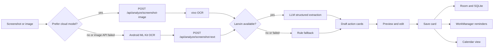

# Architecture

## Runtime Flow

## Backend Boundaries

- `api/endpoints`: HTTP boundary only.
- `services/analyzer.py`: orchestration between LLM and fallback extraction.
- `services/vivo_ocr.py`: vivo OCR request, response parsing, and screenshot text cleanup.
- `services/rule_extractor.py`: deterministic extraction for demo resilience.
- `repositories/cards.py`: persistence and row mapping.
- `schemas/card.py`: public request and response shape.

## Android Boundaries

- `data/remote`: Retrofit DTOs and API interface.
- `data/local`: Room entities and DAO.
- `data/repository`: merge remote, local cache, and fallback behavior.
- `domain`: deterministic extraction and reminder policy.
- `ui/screens`: feature screens.
- `ui/components`: reusable visual primitives.
