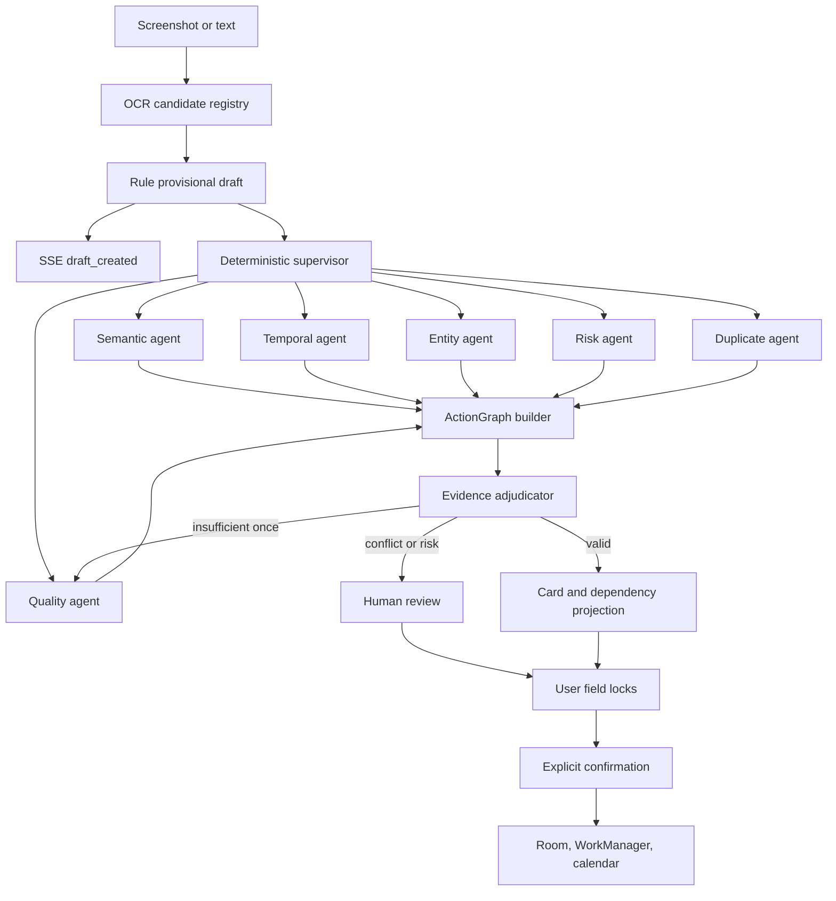

# Architecture

## Runtime Flow



The workflow is implemented with LangGraph. Its execution state is checkpointed
in `workflow.db`; the same database contains a small `workflow_runs` projection
for status queries, metrics, and restart recovery. Card data remains in
`suishouban.db`.

## Workflow API

```http
POST /api/workflows/screenshot-text
POST /api/workflows/screenshot-image
GET  /api/workflows/{run_id}
GET  /api/workflows/{run_id}/events
POST /api/workflows/{run_id}/ocr-candidates
PATCH /api/workflows/{run_id}/draft
POST /api/workflows/{run_id}/confirm
POST /api/workflows/{run_id}/resume
```

Workflow starts return HTTP 202 immediately. The event stream emits replayable
SSE events for provisional drafts, model enhancement, review, completion, and
failure. Android races ML Kit against cloud OCR and submits the first local
candidate without creating a second run.

The supervisor selects from a fixed expert allow-list and emits real LangGraph
`Send` branches. Experts only contribute evidence; the adjudicator is the sole
component allowed to select field values. A model-backed semantic expert is
optional and degrades to deterministic evidence when no provider is configured.

The durable result contains an `ActionGraph` with actions, entities,
constraints, dependencies, evidence, conflicts, and suggestions. Public cards
remain backward compatible and include optional action IDs, dependency IDs, and
evidence summaries.

Draft patches support both the legacy full-card payload and field operations
with independent versions. User-locked fields cannot be overwritten. A run
stops at `awaiting_review`; only explicit confirmation produces `completed`.

Resume commands remain `provide_ocr_text`, `review_cards`, and `cancel` for
client compatibility. Legacy `/api/analyze/*` endpoints wait up to 1.5 seconds
for a final or provisional result.

## Performance

- Shared HTTP/2 clients, provider semaphores, circuit breakers, and connection reuse.
- SQLite WAL, atomic state/event commits, sparse state snapshots, task leases,
  restart recovery, and idempotent append-only events.
- SHA-256 extraction cache keyed by normalized text, model, and prompt version.
- `GET /api/metrics/performance` reports first-draft/final latency percentiles,
  cache hit rate, route counts, and fallback rates.

## Backend Boundaries

- `api/endpoints`: HTTP boundary only.
- `services/workflow_graph.py`: pure graph state transitions and real expert fan-out/fan-in.
- `services/workflow_agents.py`: supervisor policy, expert evidence, ActionGraph, and adjudication.
- `services/workflow_service.py`: run lifecycle, event projection, field locks, leases, and recovery.
- `repositories/workflows.py`: durable run projection and workflow metrics.
- `services/analyzer.py`: compatibility adapter for the legacy analyze API.
- `services/vivo_ocr.py`: vivo OCR request, response parsing, and screenshot text cleanup.
- `services/rule_extractor.py`: deterministic extraction for demo resilience.
- `repositories/cards.py`: persistence and row mapping.
- `schemas/card.py`: backward-compatible card shape.
- `schemas/action_graph.py`: evidence graph, dependencies, constraints, and conflicts.

## Android Boundaries

- `data/remote`: Retrofit DTOs and API interface.
- `data/local`: Room entities and DAO.
- `data/repository`: merge remote, local cache, and fallback behavior.
- `domain`: deterministic extraction, OCR arbitration, screenshot gate, local/AI action enhancers, and reminder policy.
- `ui/screens`: feature screens.
- `ui/components`: reusable visual primitives.
