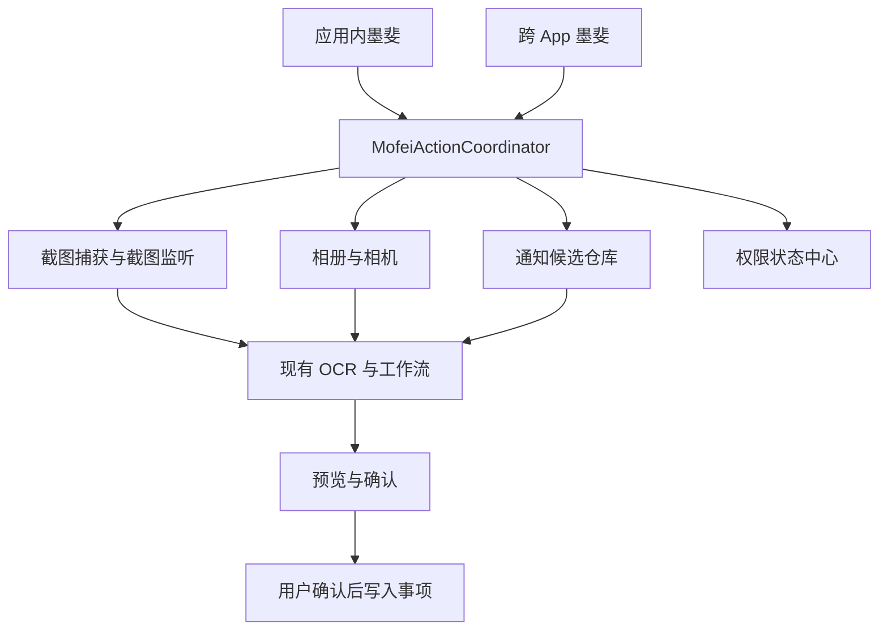

# 墨斐统一行动中心设计

日期：2026-07-20  
状态：已确认

## 目标

把墨斐从仅展示情绪和跳转事项的悬浮精灵，扩展为能够调用随手办核心能力的统一行动入口。

本阶段包含：

- 应用内截图识别、相册导入和拍照识别。
- 跨 App 主动捕获当前屏幕并分析。
- 保留现有系统截图自动检测并与主动捕获去重。
- 读取用户允许名单内的通知，生成待确认草稿。
- 所有识别结果必须经过预览和确认，不自动写入正式事项。

本阶段不处理 Android 分享入口，不使用无障碍服务读取其他 App 页面，也不引入自然语言工具调用。

## 现状

当前墨斐已经具备应用内常驻、跨 App 悬浮窗、情绪状态、事项跳转、拖拽吸边和设置入口。应用也已经具备相册、拍照、图片 OCR、系统截图监听和事项预览确认链路。

主要缺口是墨斐没有统一的业务动作模型：应用内轻点主要显示状态和“查看事项”，跨 App 悬浮层也没有成为截图、通知草稿等能力的入口。

## 总体架构

新增统一的 `MofeiActionCoordinator`。应用内墨斐和系统悬浮墨斐只负责展示入口，所有动作可用性、权限判断和业务路由均由协调器统一管理。

统一动作集合：

- 识别当前屏幕。
- 分析最近截图。
- 从相册识别。
- 拍照识别。
- 查看通知草稿。
- 查看当前事项。
- 打开墨斐设置。

应用内展示完整动作集合。跨 App 悬浮层展示精简集合；需要 Activity Result 的相册、相机和屏幕捕获授权由主应用或专用透明 Activity 承接。

## 墨斐能力环

行动中心不使用普通矩形卡片或按钮宫格。轻点墨斐后，墨斐退向屏幕边缘并以自身为核心展开“能力环”。

- 第一层能力为识别当前屏幕、最近截图和通知草稿。
- 应用内第二层增加相册、拍照和查看事项。
- 选中能力后，对应徽记向墨斐聚拢，墨斐切换为扫描、等待确认或完成动作。
- 未授权能力显示为暗色封印态；点击后先说明用途，再进入系统授权。
- 通知候选表现为围绕墨斐的“消息萤火”，而不是列表卡片。
- 收起时能力模块回收到墨斐核心。

图像生成用于制作：

- 半透明机械光环与展开骨架。
- 六类专属能力徽记及其待命、激活、封印状态。
- 扫描波纹、能量轨迹、授权封印和消息萤火纹理。
- 应用内完整能力环与跨 App 紧凑能力环两套尺寸。

图片只承担外壳、徽记和纹理。文字、权限状态、点击区域和动态数据由 Compose 原生绘制，以保证清晰度、无障碍和可靠命中区域。生成资产不得包含文字，并须提供透明背景和足够安全边距。

## 权限模型

权限中心向行动层暴露四种状态：可用、未授权、系统不支持、临时处理中。

### 屏幕捕获

Android 14 及以上要求每个新的 `MediaProjection` 捕获会话重新取得用户同意，授权令牌不得重复创建捕获会话。因此不设计静默永久截屏。

操作流程：

1. 用户在跨 App 能力环点击“识别当前屏幕”。
2. 专用授权 Activity 请求 `MediaProjection` 同意。
3. `MofeiScreenCaptureService` 以前台服务形式创建一次捕获会话。
4. 服务捕获一帧并写入应用私有缓存。
5. 服务立即释放 `VirtualDisplay`、`MediaProjection` 和图像资源并停止。
6. 捕获结果进入现有截图预览流程。

Manifest 需要声明 `FOREGROUND_SERVICE_MEDIA_PROJECTION`，服务类型为 `mediaProjection`。

### 相册与拍照

- 相册采用系统 Photo Picker，只授权用户选择的图片，不申请整个图库读取权。
- 拍照继续调用系统相机，通过临时 `content://` URI 接收结果。
- 两者统一调用现有 `AppViewModel.analyzeImage()`。

### 通知读取

新增 `MofeiNotificationListenerService`，由用户在系统通知访问设置中明确授权。

- 默认不处理任何 App。
- 用户从可选 App 列表逐个加入允许名单。
- 只处理允许名单中的通知包名。
- 验证码、支付结果、常驻服务、本 App 通知和通知分组摘要直接过滤。
- 仅提取标题、正文、来源 App 和时间。
- 不自动创建正式事项。

官方平台依据：

- [Android MediaProjection](https://developer.android.com/media/grow/media-projection)
- [MediaProjectionManager API](https://developer.android.com/reference/android/media/projection/MediaProjectionManager)
- [NotificationListenerService API](https://developer.android.com/reference/android/service/notification/NotificationListenerService.html)

## 数据流

### 应用内识别

能力环动作 → 相册或相机 Activity Result → `analyzeImage()` → 现有 OCR/云端工作流 → Preview → `confirmDrafts()`。

### 主动屏幕识别

能力环动作 → MediaProjection 同意 → 单帧私有缓存 → 内容哈希去重 → 现有截图预览 → 用户确认。

### 系统截图识别

`ScreenshotMonitorService` 检测新截图 → 墨斐扫描态和提示 → 内容哈希去重 → 现有截图预览 → 用户确认。

### 通知草稿

通知回调 → 包名允许名单 → 敏感类型和噪声过滤 → 本地候选仓库 → 墨斐待确认数量和消息萤火 → 用户打开候选 → 现有文本分析工作流 → Preview → 用户确认。

通知原文和待确认候选仅保存在本机，不参与同步。用户拒绝后立即删除，未处理候选按期限自动清理。

## 失败处理

- 取消屏幕捕获：能力环平稳收起，不反复请求授权。
- 受保护页面产生空白或纯黑结果：显示“这个页面禁止截取”，不提交 OCR。
- OCR 或后端失败：当前流程内允许重试；退出流程后删除临时图像。
- 通知访问被撤销：通知能力转为封印态，其他能力保持可用。
- 通知不在允许名单或命中过滤规则：静默丢弃。
- 主动捕获和系统截图监听得到同一画面：按内容哈希去重。
- 服务或进程被系统回收：不得留下投屏资源、悬浮窗口或永久处理中状态。

## 测试与验收

### 自动化测试

- 行动路由和动作可用性。
- 权限状态映射及撤销后的更新。
- 通知允许名单、敏感通知过滤和候选过期。
- 截图内容哈希去重。
- 屏幕捕获取消、失败和资源释放。
- 能力环待命、封印、处理中、失败和待确认状态。

### 真机验证

- Android 13、14 和较新系统上的 MediaProjection 流程。
- 相册、拍照、主动截屏和系统截图监听。
- 通知访问开启、撤销、允许名单更新和服务重连。
- 锁屏、横竖屏切换、进程回收和权限被系统撤销。
- 减少动态效果下所有状态仍可从静态颜色、徽记和文字理解。

### 数字资产验收

- 透明背景，无白边和脏边。
- 应用内与跨 App 尺寸下均可辨认。
- 图片不包含文字或动态数据。
- 点击范围由 Compose 定义，不依赖图像中的不可见区域。
- 与现有墨斐蓝色玻璃、深蓝面罩、电青与紫色能量语言一致。

## 完成标准

- 应用内墨斐可直接启动截图识别、相册和拍照。
- 跨 App 墨斐可主动捕获当前屏幕，也能响应系统截图。
- 只处理用户允许名单中的通知。
- 通知和截图结果均先进入预览确认，不自动写入事项。
- 权限拒绝、撤销和平台不支持不会导致崩溃或破坏其他能力。
- 能力中心呈现为具有墨斐特征的能力环，而不是普通卡片面板。
