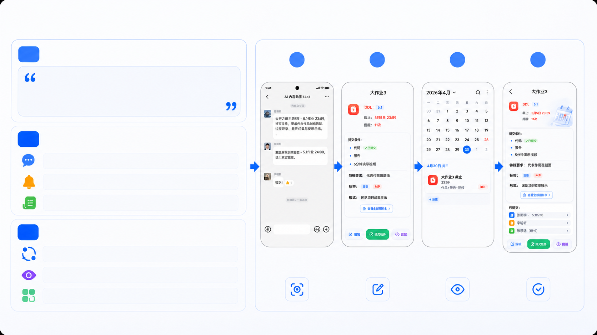
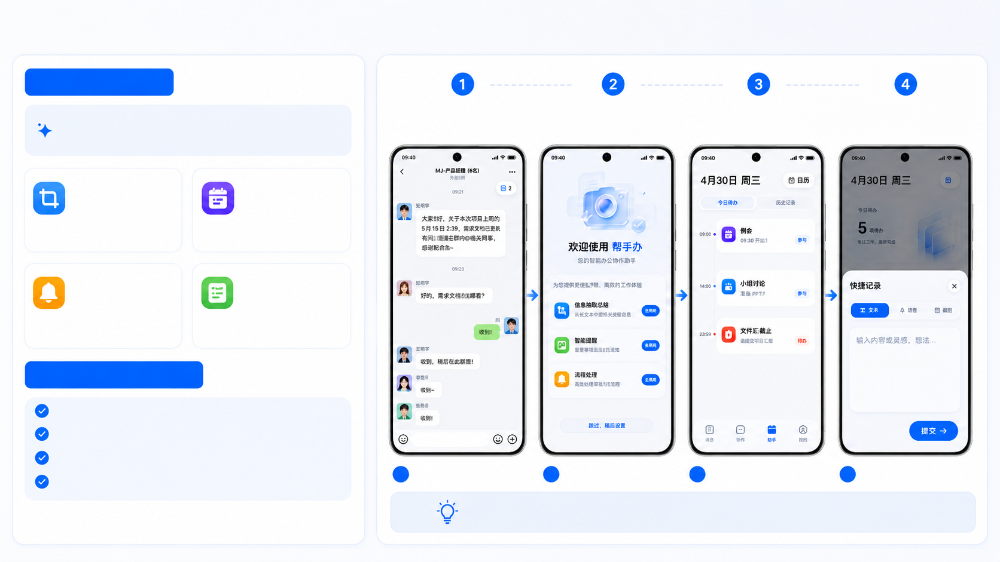
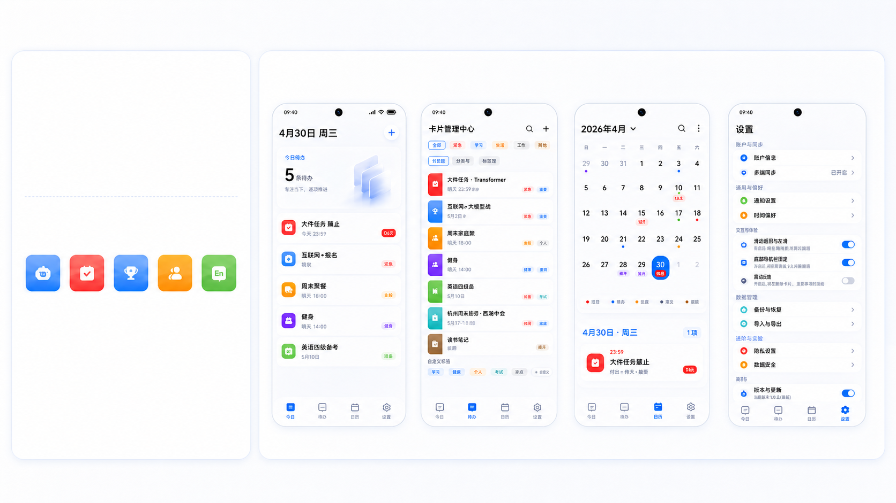
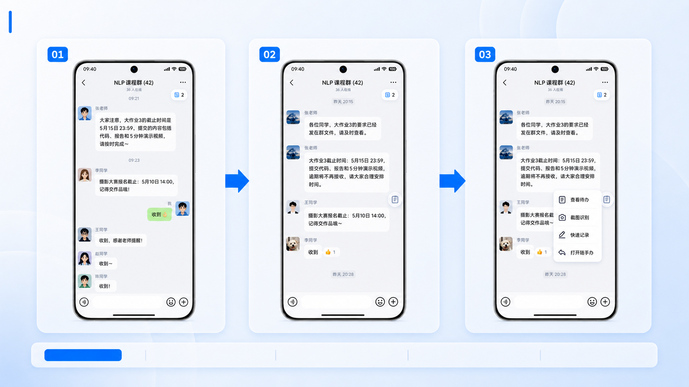
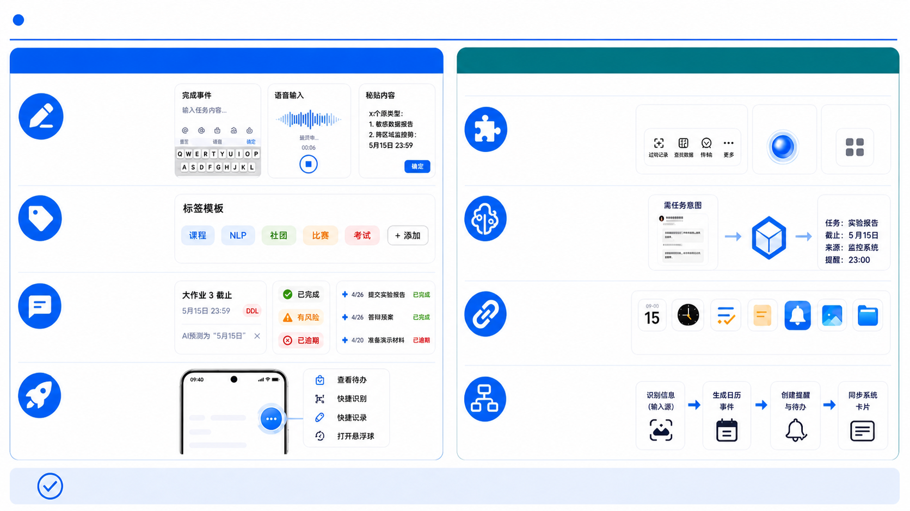
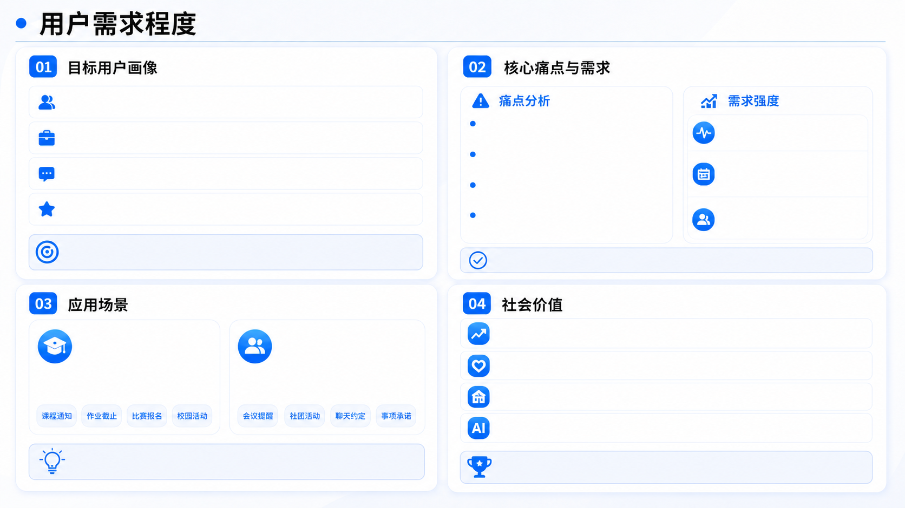
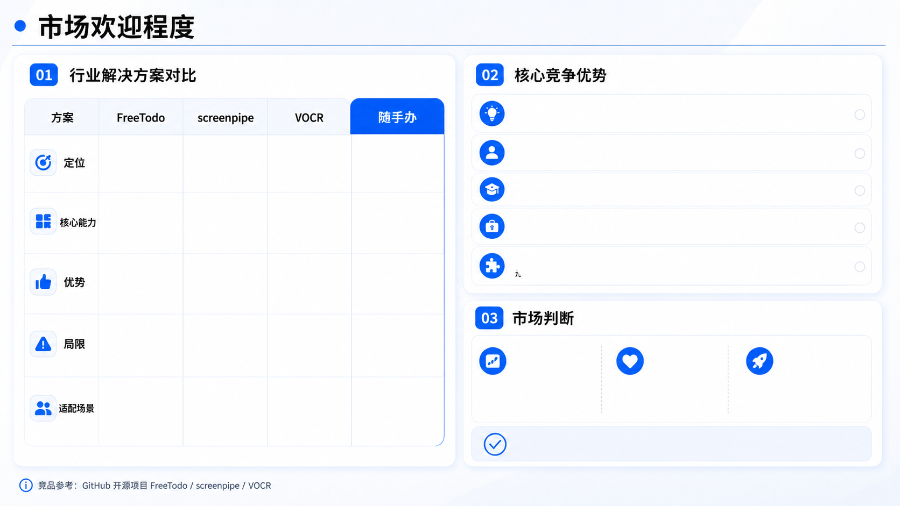

# 随手办

- Source: `随手办.pptx`
- Total slides: 13

## Slide 1

随手办

随手办

截图触发的AI行动助手

2026 中国大学生计算机大赛

AIGC创新赛

华中科技大学 | 团队：给我干哪来了

## Slide 2

一、团队介绍

## Slide 3

一、团队介绍

团队名称：给我干哪来了

01

02

03

俞乐遂

范佳润

曹钰湫

华中科技大学

华中科技大学

华中科技大学

角色

角色

角色

产品经理

UI与交互设计

软件开发

前端开发

负责需求分析、产品规划、原型设计、界面与交互方案

负责核心功能实现、逻辑开发、模型能力接入

负责页面搭建、交互落地

协作流程

产品规划

界面设计

前端落地

功能落地

联调测试

## Slide 4

二、作品简介

## Slide 5

二、作品简介

①作品名称

②作品概述

③宣传海报

- 随手办是一款面向大学生与高频信息处理人群的AI行动卡助手，适用于课程群通知、比赛报名、社团消息、会议提醒等场景。
- 用户截图后，系统自动识别时间、地点、截止时间、提交物和任务类别，生成可编辑的行动卡，并联动日历、提醒与任务清单，进一步安排补充你的日程。
- 作品的突出创新在于以截图为统一入口，将识别、理解与行动编排打通，降低信息整理成本，减少遗忘和漏办。
- 核心功能包括截图识别、行动卡生成、动作预览、一键创建提醒、多标签管理。

随手办

截图触发的AI行动助手

## Slide 6

三、作品策划

## Slide 7

三、作品策划

01

核心创新点

1

2

3

4

截图识别

信息识别

进程同步

结束创建

以截图为方式，使用蓝心大模型以OCR能力提取相关信息，并整理为行动卡并存入日程。

02

设计背景与洞察

1.大学生高频通过截图保存信息但利用率低，整理成本高

2.通知的关键信息保存在各个页面中，寻找难度大

3.通过文字识别各种标签提取较为困难

03

设计理念

1.从识别、确认到落地，流程完整，形成闭环

- 自动识别截图中的
- 关键信息与结构化字段

- 核对并编辑识别结果，
- 修改相关信息

- 将具体日程同步
- 到日期提醒当中

- 生成落地行动卡
- 创建相关信息

2.生成可编辑结果再进行动作预览，可增加容错更加灵活

3.统一采用卡片化的结构，样式简单统一

## Slide 8

三、作品策划

04 核心功能解读

OCR识别

从截图理解到卡片执行，将分散信息整理为可统一存储管理提醒的行动卡

截图输入

大模型理解

动作执行

截图识别

行动卡生成

从群聊、通知、海报中提取文本与关键信息

自动生成任务、事件、承诺等结构化卡片

智能提醒

动作预览

根据截止时间生成提醒策略并可手动调整

创建前展示日历事件、提醒、可能存在冲突等提示

05 蓝心大模型应用

对OCR文本做语义理解与结构化抽取

识别事件、时间、地点、人物、要求等

判断卡片类型与优先级，补全标签与提醒

原始截图（聊天/通知等）

OCR识别（文本提取）

大模型理解（结构化卡片）

动作执行（创建/提醒）

对模糊时间进行消歧，标记待确认项

流程闭环：从截图获取信息—>识别抽取—>语义理解—>结构化生成—>执行落地

## Slide 9

三、作品策划

07 关键界面展示

06 整体视觉风格与色彩体系

- 今日主页
- 聚焦当日待办与快捷操作

- 卡片管理中心
- 支持筛选、分类和标签管理

- 日历视图
- 在时间维度查看所有时间安排

- 设置中心
- 支持同步、提醒、隐私等功能

- 整体采用极简、轻拟态、玻璃感与卡片化的设计；大圆角、柔和阴影和清晰留白共同营造轻盈、可信赖的视觉体验。
- 整体风格与vivo的UI设计基调一致

智能蓝

任务红

事件蓝

承诺橙

其他绿

以智能蓝为主色调，辅以语义色，帮助用户完成信息识别与状态判断

- 任务卡：识别截图中包含明确截止时间和待办事项的任务
- 事件卡：识别截图中包含确定时间和地点的事件。
- 承诺卡：识别聊天记录截图中的承诺、约定、帮忙等社交承诺。
- 其他卡：截图中包含有价值信息但不涉及明确行动项。

## Slide 10

三、作品策划——交互设计

识别行动信息

展开快捷菜单

唤起悬浮球

交互亮点

跨应用入口

轻量打断

一步直达

低操作成本

## Slide 11

三、作品策划——交互设计

创新交互

后续展望：VIVO系统的可移植性

快速记录

粘贴内容：具体活动通知

组件化接入

截图菜单

悬浮球

快捷入口

支持语音、文字、粘贴三种录入方式，降低输入成本，提高记录效率。

可将该能力封装为OriginOS系统组件或服务，接入系统位置，提升调用效率与可复用性。

标签模板

蓝心大模型适配

课程群截图

蓝心大模型

结构化

课程、社团、比赛、考试等标签模板可快速复用，减少重复设置

可借助蓝心大模型在OriginOS系统中的语义理解，意图调度与多应用编排能力，提升具体任务的系统适配效果。

多模态反馈

多应用联动

通过浮窗预览、状态标签、时间线提醒等方式帮助用户快速确认，多模态进行反馈

可与OriginOS中自带的日历、时钟、待办、便签、通知中心、相册、文件管理等应用联动，自动生成相关任务。

系统级工作流

轻量入口

在后续版本中，可尝试将“识别截图一提取任务一生成日历事件一创建提醒与待办一同步系统卡片”串联为完整工作流，提升OriginOS场景下的执行闭环。

提供悬浮菜单、快速记录等轻量入口，减少层级跳转

通过组件化接入、蓝心大模型调度与多应用联动，随手办可较高适配OriginOS，形成可落地的系统级智能行动工作流

## Slide 12

三、作品策划——用户需求程度

核心人群：18-26岁大学生、研究生、初入职场青年

信息分散: 截图、群聊、海报、通知分散在不同入口，后续难检索

需求属性:高频、刚需、持续发生

典型身份：学生干部、社团骨干、实习生、科研助理等

漏办高发: 截止时间、地点、提交物、承诺事项容易遗漏

使用频率:日均多次，覆盖学习、社团实习与协作场景

高频场景：课程群通知、比赛报名、社团活动、会议提醒

整理成本高: 需要手动摘录到日历、待办、提醒，重复操作多

用户特征：习惯截图保留信息，事务繁忙，懒得做日程表

用户期待:更快识别、更少漏办、更低操作成本

理解负担大:通知表达不统一，关键信息提取费时

核心目标用户:高频处理碎片信息、对效率与体验敏感的人群

通过 截图识别一语义理解一行动卡生成一提醒落地 满足强场景。

提升个人与团队执行效率:减少遗漏、延误和重复确认

场景一：学习与校园事务

场景二：协作与日程安排

用户保存课程群、作业通知、比赛报名等截图，系统自动提取截止时间、提交要求与地点，并生成任务卡与提醒。

用户保存会议通知、社团活动、聊天约定等截图，系统识别时间、人物、地点与待办事项，自动生成事件卡或承诺卡。

降低信息焦虑:帮助用户把碎片信息转化为可执行任务

推动校园数字化:提升学习、社团等协作场景的信息管理效率

普惠AI能力:以低门槛入口让更多用户享受智能生产力工具

从“先截图、后遗忘”转向“一截图、即执行”

以轻量可落地的方式，将AI能力转化为学习、工作与协作中的真实生产力。

## Slide 13

功能创新性:以截图为统一入口，打通OCR识别一语义理解一行动编排一提醒落地

用户体验优先:无需手动摘录，多一步动作预览，降低遗漏与误触风险

- 屏幕记忆
- 与自动化

OCR识别辅助工具

截图触发的AI行动助手

AI待办管理

场景适配优势:贴合大学生与高频信息处理人群的真实高频场景

屏幕内容记录、检索、代理触发

屏幕识别、OCR、可访问性支持

- 截图理解
- 行动卡生成提醒落地

- 任务拆解
- 日程管理

模型适配优势:采用在语义理解、意图调动等方面表现好的蓝心大模型

生态延展优势:可联动日历、提醒、待办、便签等系统能力，形成长期入口

- 从截图到执行形成闭环
- 移动端低门槛

- 上下文感知强
- 本地化能力强

- 识别能力
- 直接、轻量

待办管理清晰

- 目前仅局限于校园和
- 高频记录场景

非常依赖手动输入

- 做桌面连续记录
- 学习成本较高

- 偏识别工具
- 任务编排能力弱

需求基础

欢迎原因

增长空间

截图保存信息是高频行为，转化为行动管理具备明确需求基础

- 课程通知
- 比赛报名
- 社团活动
- 会议提醒

识别快、整理少执行强，能直接减少漏办与遗忘

可从校园扩展至实习、办公、轻协作等更广泛场景

- 桌面生产力
- 自动化

- OCR读取与
- 辅助访问

个人待办整理

该产品具有较强的市场竞争力和需求基础
